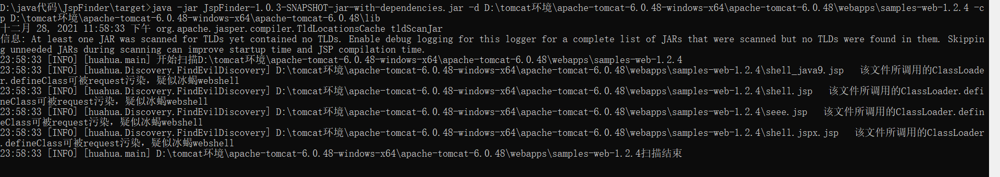
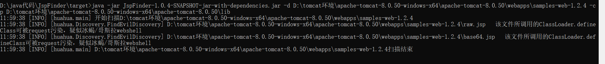
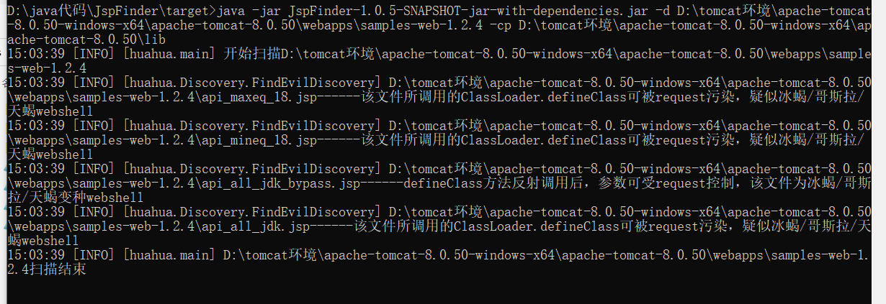
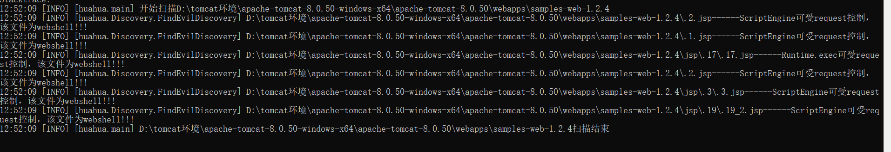
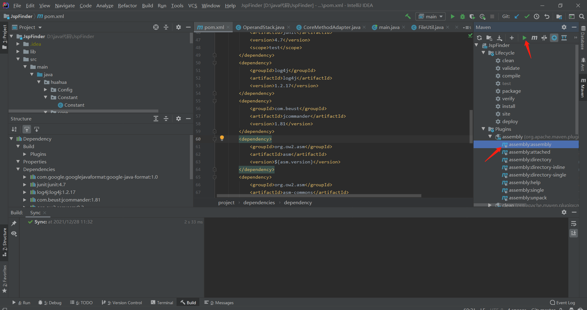
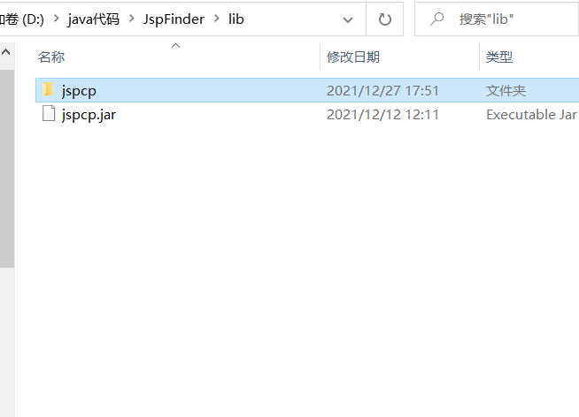
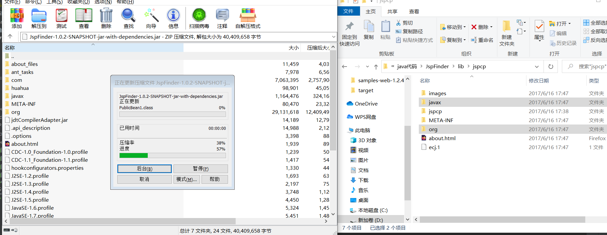

# JspFinder


### 简介

受[4ra1n](https://github.com/EmYiQing)师傅的[JSPKiller](https://github.com/EmYiQing/JSPKiller)项目的启发，开发的一款可实战的，通过污点追踪发现Jsp webshell的工具(A tool to find Jsp Webshell through stain tracking) 。污点跟踪的实现方式为将jsp编译为class后，通过java代码为class中的方法设置污点，然后模拟jvm堆栈的运行，查看污点能否流入危险方法，如:Runtime.exec、ProcessBuilder。这个过程不和web服务器有任何的挂钩和侵入，完全是独立行为，所以该检测方式不会影响服务器，可以在服务器上放心使用。检测原理文章链接：https://xz.aliyun.com/t/10727。目前可以检测Runtime/ProcessBuilder/ScriptEngine/冰蝎/哥斯拉/天蝎的webshell。

### 使用

```
Usage: <main class> [options]
  Options:
    -cp, --classpath
      指定容器的依赖jar包(tomcat例为:D:\apache-tomcat-8.0.50\lib)
    --debug
      Debug
      Default: false
    -f, --file
      指定web目录下的某个文件
    -h, --help
      Help Info
    -s, --save
      指定结果存放的文件名
      Default: result.txt
    -d, --webDir
      指定web目录，如 D:\tomcat环境\apache-tomcat-8.0.50-windows-x64\apache-tomcat-8.0.50\webapps\samples-web-1.2.4\
```

通常用法，表示检测apache-tomcat-8.0.50目录下有无jsp webshell

```
java -jar JspFinder-1.0.0-SNAPSHOT-jar-with-dependencies.jar -d  D:\tomcat环境\apache-tomcat-8.0.50-windows-x64\apache-tomcat-8.0.50  -cp D:\tomcat环境\apache-tomcat-8.0.50-windows-x64\apache-tomcat-8.0.50\lib
```


检测冰蝎webshell效果



检测哥斯拉webshell效果(raw类型和base64类型)



检测天蝎效果(普通类型和bypass类型)



检测ScriptEngine webshell效果



### 测试webshell

https://github.com/LandGrey/webshell-detect-bypass/tree/master/webshell/jsp

https://github.com/rebeyond/Behinder

https://github.com/BeichenDream/Godzilla

https://github.com/shack2/skyscorpion

https://github.com/threedr3am/JSP-Webshells/blob/master/jsp/3/3.jsp

### 编译

```
mvn assembly:assembly
```



maven编译完后会在target目录生成一个JspFinder-x.x.x-SNAPSHOT-jar-with-dependencies.jar。

然后到项目目录中的lib目录解压jspcp.jar



用压缩工具打开JspFinder-x.x.x-SNAPSHOT-jar-with-dependencies.jar，将jspcp文件夹中的javax、org两个目录拖到jar中。



得到的jar即可使用

### 优势

1、通过逆拓扑排序方法调用链后进行asm分析，可以发现跨越多个嵌套方法调用的恶意webshell

2、asm污点跟踪通过对输入流能否流入恶意方法来判断webshell，相对于只检测恶意方法字串来判断webshell的工具减少了误报

### 缺点

1、使用了gadgetinspector生成的jdk污点数据，存在漏报，目前解决方案是白名单补坑

### 后续准备实现

1、对冰蝎等多功能webshell进行检测(2021.12.28晚已实现冰蝎检测)

2、对使用混淆工具进行混淆的webshell进行检测

3、对方法的入参能否影响返回值算法更精准的优化，提高准确率

### 最近更新

[+] 2021/12/28 新增冰蝎webshell检测。修复当出现内部类时，污点分析顺序出错的问题。新增分析完毕后删除编译文件的功能。新增maven配置，添加built-by参数，防止用户名被maven打包到jar中。

[+] 2021/12/29 新增哥斯拉、天蝎webshell检测。新增jsp编译容错机制，一个jsp编译报错自动开始下一个。

### 参考

https://github.com/EmYiQing/JSPKiller

https://github.com/threedr3am/gadgetinspector

[](https://starchart.cc/flowerwind/JspFinder) 